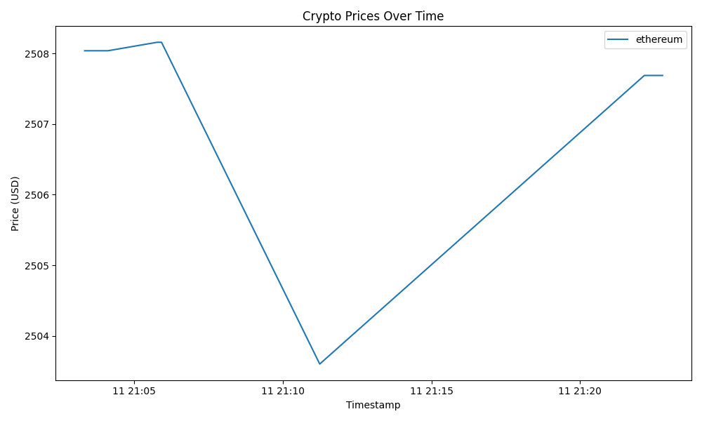

# Crypto Web Scraper

This project is a web scraper and API for tracking cryptocurrency prices. It fetches real-time prices for popular cryptocurrencies (Bitcoin, Ethereum, Dogecoin) from the CoinGecko API, stores them in a PostgreSQL database, and provides endpoints to view the latest prices and plot historical price trends.

## Features

- Scrape real-time crypto prices from CoinGecko.
- Store price data in a PostgreSQL database.
- REST API to trigger scraping, fetch prices, and generate a price trend plot.
- Plot and save a chart of price history using Matplotlib.

## Example Result

Below is an example of the generated price trend plot:



*(The image above will be generated after running the `/plot` endpoint.)*

## Getting Started

Clone the repository:

```sh
git clone https://github.com/General-Sandwalker/crypto-web-scraper.git
cd crypto-web-scraper
```

## API Endpoints

- `POST /scrape` — Fetch and store the latest prices.
- `GET /prices` — Get the 100 most recent price records.
- `GET /plot` — Generate and save a plot of price history.

## Local Deployment (Python)

1. **Install dependencies**  
    Make sure you have Python 3.13+ and PostgreSQL installed and running.

    ```sh
    pip install -r requirements.txt
    ```

2. **Set up PostgreSQL**  
    Create a database and user matching the connection string in `main.py` (default: `user:password@localhost:5432/cryptodb`).

    ```sh
    # Example using psql
    psql -U postgres
    CREATE DATABASE cryptodb;
    CREATE USER "user" WITH PASSWORD 'password';
    GRANT ALL PRIVILEGES ON DATABASE cryptodb TO "user";
    ```

3. **Run the FastAPI app**

    ```sh
    uvicorn main:app --reload
    ```

4. **Access the API**  
    Visit [http://localhost:8000/docs](http://localhost:8000/docs) for the interactive Swagger UI.

## Deployment with Docker Compose

1. **Build and start the services**

    ```sh
    docker-compose up --build
    ```

2. **Access the API**  
    Visit [http://localhost:8000/docs](http://localhost:8000/docs) in your browser.

## Notes

- The plot image (`crypto_prices.png`) will be saved in the project directory after calling the `/plot` endpoint.
- You can customize the list of cryptocurrencies by editing the `fetch_crypto_prices` function in `main.py`.

---
